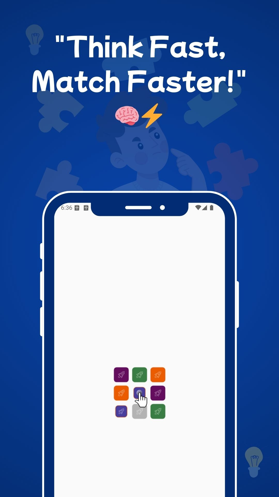
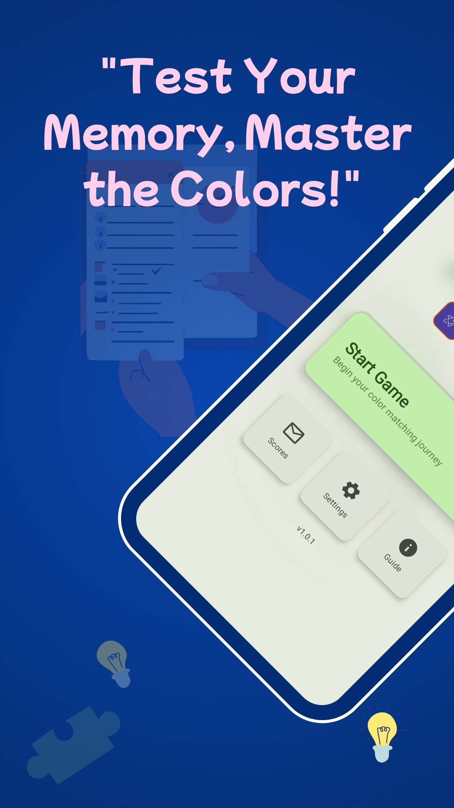
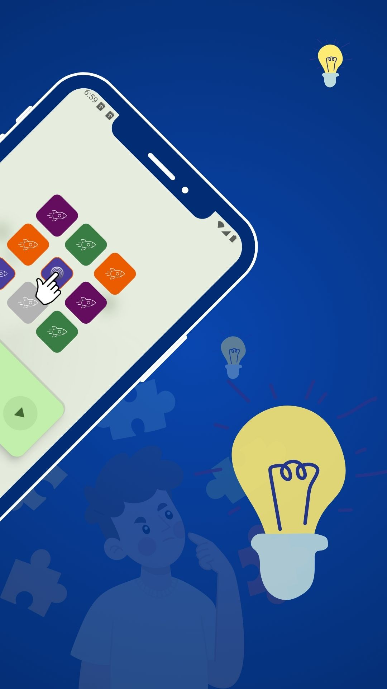
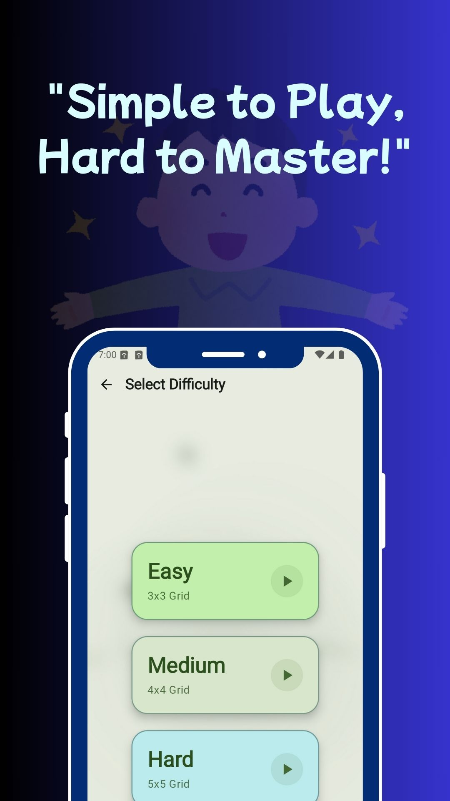
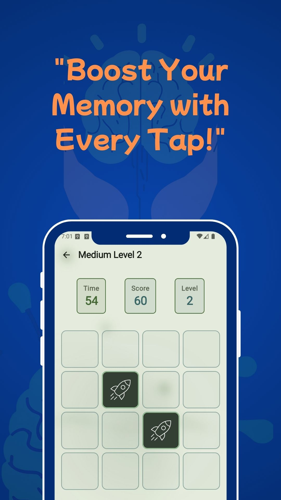
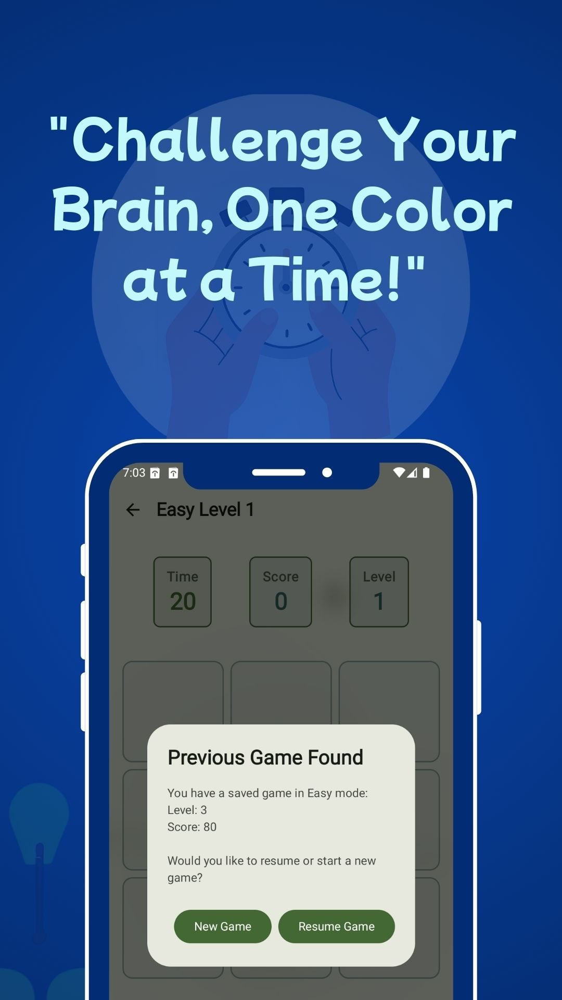
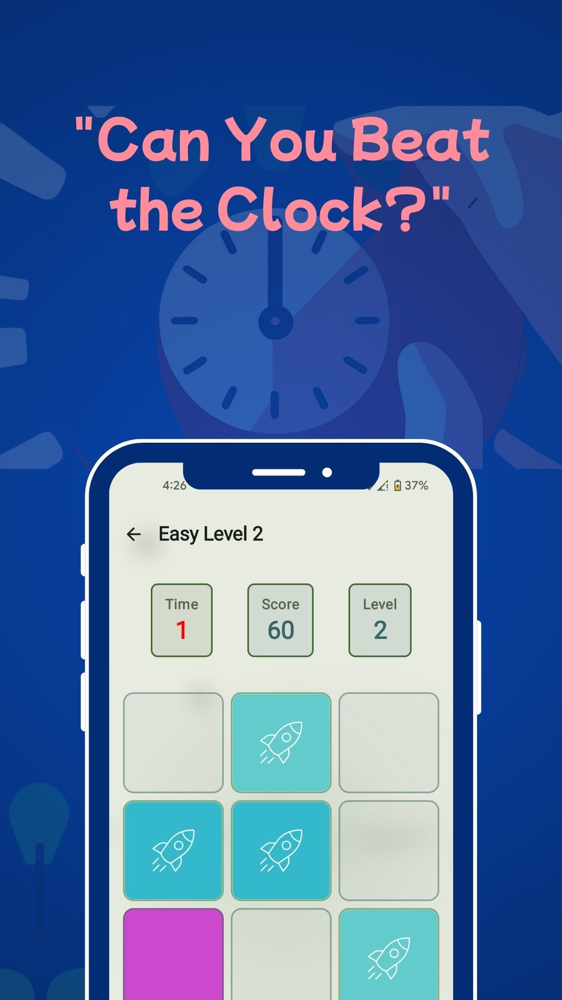
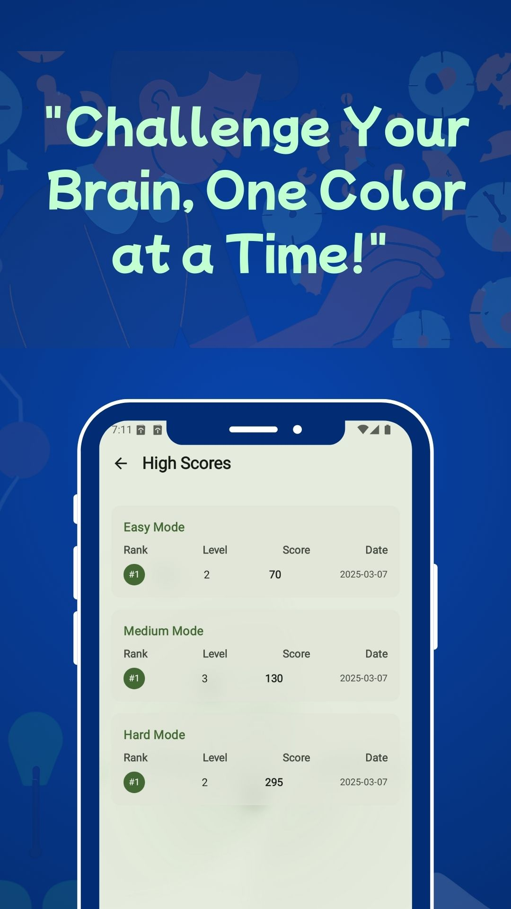

# App Store Project

Welcome to the App Store, a project showcasing a simple web-based application store interface. Users can browse featured, trending, recommended, and all available applications. Each application has a dedicated details page with descriptions, ratings, screenshots, and a download link.

## Features

- **Homepage:** Displays various categories of apps like Featured, Trending, and Recommended.
- **App Listings:** Grid view of applications with icons, names, categories, and ratings.
- **App Details Page:** Shows comprehensive information about each app, including a banner, detailed description, version, category, rating, price (currently all free), and download button.
- **Responsive Design:** Adapts to different screen sizes for a good user experience on desktops, tablets, and mobile devices.

## Screenshots

Here are some example screenshots from one of the apps:

**Mind Color Challenge Screenshots:**

<table>
  <tr>
    <td></td>
    <td></td>
    <td></td>
    <td></td>
  </tr>
  <tr>
    <td></td>
    <td></td>
    <td></td>
    <td></td>
  </tr>
</table>

_Note: Add more relevant screenshots of the App Store interface itself if available._

## Access the App Store

You can access the live App Store via the following link:

<a href="https://apps.toufikhasan.com/" target="_blank"></a>

Or directly: <a href="https://apps.toufikhasan.com/" target="_blank">https://apps.toufikhasan.com/</a>

## Technologies Used

- HTML5
- CSS3 (with CSS Variables and Flexbox/Grid for layout)
- JavaScript (for dynamic content rendering and interactions)

## Project Structure

```
ClientAppStore/
├── css/
│   ├── style.css         # Main styles for the application
│   └── responsive.css    # Styles for different screen sizes
├── downloads/            # Placeholder for APK files
├── icons/                # App icons
├── screenshots/          # Screenshots for apps (and potentially the store itself)
│   └── mcc/              # Example screenshots for an app
├── app-details.html      # Template for individual app detail pages
├── app-details.js        # JavaScript for app detail pages
├── index.html            # Main landing page of the App Store
├── script.js             # JavaScript for the main page (app listings, filtering)
└── README.md             # This file
```

## To-Do / Potential Improvements

- Add actual app store screenshots to the README.
- Implement a backend to manage apps dynamically.
- Add user authentication and review submission features.
- Enhance search and filtering capabilities.
- Add more detailed error handling and user feedback.
